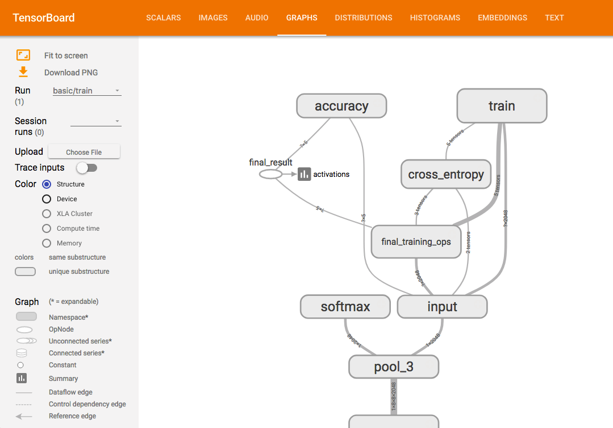
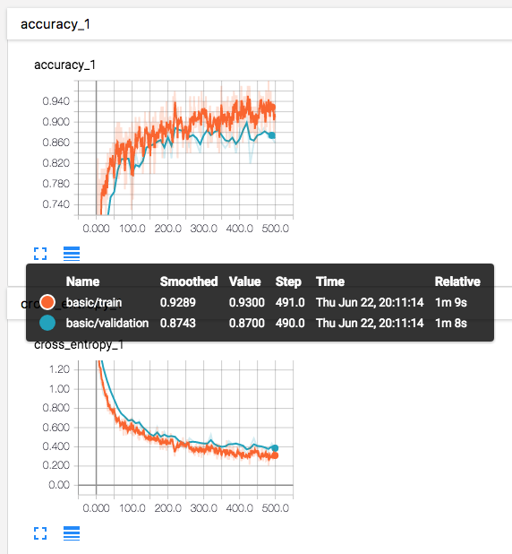
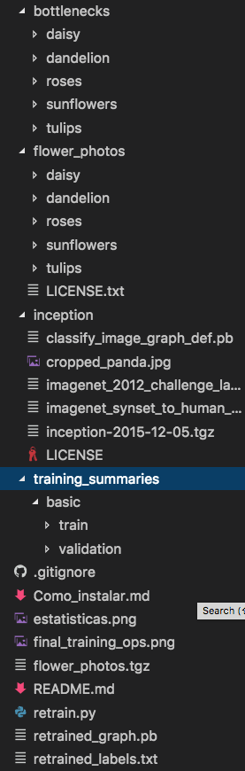
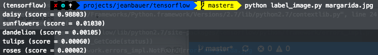

O que vamos fazer?
- Usar Python para treinar um classificador de imagens
- Classificar nossas próprias imagens com esse classificador

```
No presente algoritmo, usaremos o aprendizado de transferência, o que significa que estaremos começando com um modelo já treinado sobre outro problema. Em seguida, o treinaremos em um problema semelhante. O deep learning a partir do zero pode levar dias, mas a transferência de aprendizagem pode ser feita em curto prazo.

Vamos usar a rede Inception v3. Inception v3 é treinada para o Recurso de Reconhecimento Visual Large ImageNet usando os dados de 2012, e pode diferenciar entre 1.000 classes diferentes, como Dalmatas ou lava-louças. 
```

# Instalando dependências
Baixe o dataset:
`curl -O http://download.tensorflow.org/example_images/flower_photos.tg`

Depois extraia:
`tar xzf flower_photos.tgz`

Vamos baixar o script que treina imagens, chamado **retrain**. _(bem sugestivo)_

`curl -O https://raw.githubusercontent.com/tensorflow/tensorflow/r1.1/tensorflow/examples/image_retraining/retrain.py`

Inception é um modelo de classificação de imagem enorme com milhões de parâmetros que podem diferenciar uma grande quantidade de tipos de imagens. Estamos apenas treinando a camada final dessa rede, então o treinamento terminará em um período razoável de tempo.

Para ver estatísticas da nossa execução, rode:
`tensorboard --logdir training_summaries &`

E depois vá em: http://0.0.0.0:6006/

Agora, no mesmo terminal, cole o seguinte trecho:
```
python retrain.py \
  --bottleneck_dir=bottlenecks \
  --how_many_training_steps=500 \
  --model_dir=inception \
  --summaries_dir=training_summaries/basic \
  --output_graph=retrained_graph.pb \
  --output_labels=retrained_labels.txt \
  --image_dir=flower_photos
```

Este script faz o download do modelo pré-treinado Inception v3, adiciona uma nova camada final e treina essa camada nas fotos de flores que você baixou.

# Inception
A ImageNet não foi treinada em nenhuma dessas espécies de flores originalmente. No entanto, os tipos de informações que possibilitam que a ImageNet se diferencia entre 1.000 classes também são úteis para distinguir outros objetos. Ao usar esta rede pré-treinada, estamos usando essa informação como entrada para a camada de classificação final que distingue nossas classes de flores.

O modelo Inception v3 é composto de muitas camadas empilhadas uma sobre a outra, uma imagem simplificada do TensorBoard é mostrada acima (Figura 2). Essas camadas são pré-treinadas e já são muito valiosas para encontrar e resumir informações que ajudarão a classificar a maioria das imagens. O que estamos fazendo é treinar a ultima camada apenas (final_training_ops na figura abaixo). Enquanto todas as camadas anteriores mantêm seu estado já treinado.



Uma vez que a etapa de treinamento já ocorreu, (em média 30 min), vá até o dashboard na porta 6006 e clique em 'Graphs'.

Curiosidade: Por que esta etapa é chamada de Bottleneck?
```
Um "Bottleneck", é um termo informal que é usado frequentemente para a camada logo antes da camada de saída final que realmente faz a classificação. Como, perto da saída, a representação é muito mais compacta do que no corpo principal da rede.

Toda imagem é reutilizada várias vezes durante o treinamento. O cálculo das camadas por trás do gargalo para cada imagem leva uma quantidade significativa de tempo. Como essas camadas inferiores da rede não estão sendo modificadas, suas saídas podem ser armazenadas em cache e reutilizadas.

Então, o script está executando a parte constante da rede, tudo abaixo do nó denominado Bottlene, acima e fazendo cache(caching) dos resultados.
```

O comando que você executou salvou esses arquivos para os gargalos / diretório. Se você voltar a executar o script, eles serão reutilizados, então você não precisa esperar por essa parte novamente.

# Visualizando o resultado do treinamento
Na aba "SCALARS" é possível ver algumas estatísticas em formato de gráfico sobre alguns pontos como Precisão, Entropia e outras estatísticas nerds que não sabemos o que faz ainda. Heh.



Uma verdadeira medida do desempenho da rede é medir seu desempenho em um conjunto de dados que não está nos dados de treinamento. Esse desempenho é medido usando a precisão de validação. Se a precisão do treinamento for alta, mas a precisão da validação permanece baixa, isso significa que a rede está em excesso e a rede está memorizando características específicas nas imagens de treinamento que não ajudam a classificar imagens de forma mais geral.

Você deve ver um valor de precisão entre 85% e 99%, embora o valor exato variará de execução para execução, uma vez que há aleatoriedade no processo de treinamento. Esse valor de número indica a porcentagem das imagens no conjunto de teste que receberam o rótulo correto após o modelo estar totalmente treinado.

O script de re-treino irá escrever uma versão da rede Inception v3 com uma camada final retreinada para suas categorias em **_recruitined_graph.pb_** e um arquivo de texto contendo os rótulos para **_recruitined_labels.txt_**.

Só para validarmos, é importante que a árvore de arquivos esteja mais ou menos assim: (pois não fizemos commit dos datasets)



# Classificando uma imagem
Nós vamos copiar um algoritmo que cria uma label para nossa imagem nova que classificaremos.

Digite:
`curl -L https://goo.gl/3lTKZs > label_image.py`
 
e confie :D

Agora vamos rodar! (Finalmente :tada:)

`python label_image.py margarida.jpg`

Resultado:


Agora tente com outra:
`python label_image.py dalmata.jpg`

Provavelmente os resultados não foram satisfatórios, isso porque nosso dataset de treinamento foi composto primáriamente de flores :D

Existem outras maneiras de fazer o treinamento, por exemplo, o parâmetro `--learning_rate` controla a magnitude das atualizações na camada final durante o treinamento. Até agora, deixamos isso fora, usando o valor de `0,01`. Se essa taxa for menor, como `0,005`, a aprendizagem demorará mais, mas pode ajudar a precisão geral. Valores mais altos, como `1,0`, podem treinar mais rapidamente, mas podem obter resultados finais pior, ou mesmo tornar-se instável.

**Cada caso é um caso! Veja qual learning rate é melhor para seu problema através de testes.**